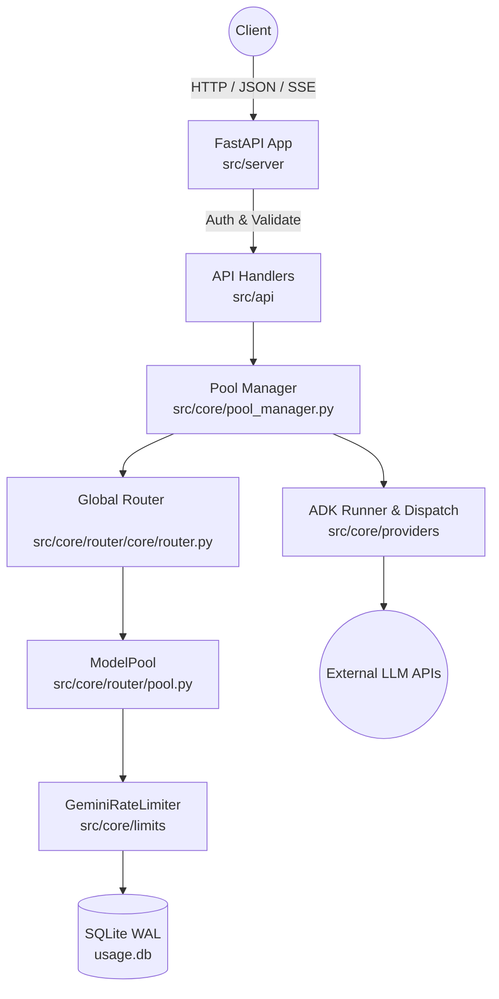
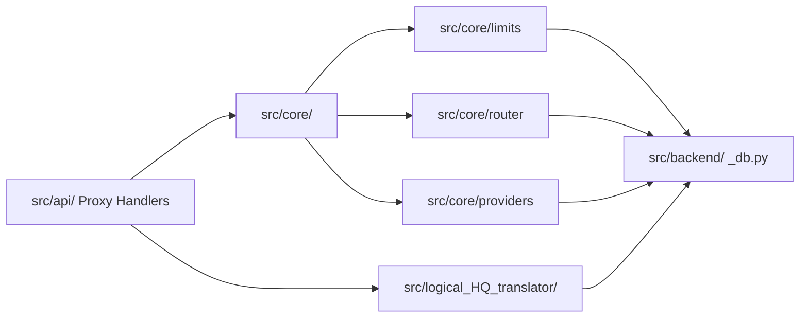
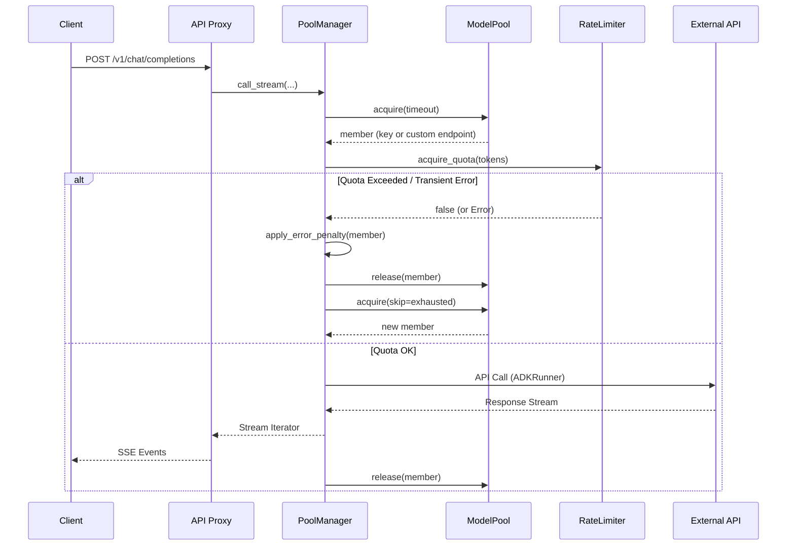

# ARCHITECTURE GRAPH REPORT

## SECTION 1: System Overview (TL;DR)
Hệ thống là một Router API (FastAPI) đóng vai trò API Gateway và Load Balancer cho các mô hình LLM (Gemini, Claude, OpenAI). Kiến trúc cốt lõi sử dụng mô hình Concurrent Worker Pool (`ModelPool`) kết hợp với Circuit Breaker (`PoolManager`) và Rate Limiting khắt khe (`GeminiRateLimiter` và `EffectiveLimits`). Các Endpoint tùy chỉnh cũng được xử lý như các first-class citizen thông qua `CustomEndpointManager` và cơ chế Pool assignments. Dữ liệu trạng thái, cấu hình và lịch sử usage được persist xuống SQLite (`usage.db`). Hệ thống ưu tiên tính Resilience (tự phục hồi, retry, đóng băng key hỏng) và kiểm soát Concurrency (slot-based acquire).

## SECTION 2: Complete File Audit Manifest
| Directory / Group | Role / Primary Responsibility | Count | Status |
| :--- | :--- | :--- | :--- |
| `src/server/` | Setup FastAPI, Middleware, Config server | 33 | Scanned (100%) |
| `src/api/` | Proxy Route / Handler / Controllers | 21 | Scanned (100%) |
| `src/core/router/` | Router & Model Pool (`ModelPool`) | 4 | Scanned (100%) |
| `src/core/limits/` | Quota / Rate Limiting (`GeminiRateLimiter`) | 9 | Scanned (100%) |
| `src/core/providers/`| Custom Endpoints, ADK Runners | 8 | Scanned (100%) |
| `src/core/` (other) | Core Business Logic (`PoolManager`) | 29 | Scanned (100%) |
| `src/backend/` | SQLite Data Access Layer | 10 | Scanned (100%) |
| `src/logical_HQ_translator/`| HQ Logic Translation (Peer of Core) | 7 | Scanned (100%) |
| `scripts/`, `main.py`, v.v. | Application Components & Tools | 13 | Scanned (100%) |
*(Tổng cộng 134 tệp mã nguồn python, đã verify toàn bộ danh sách `manifest.txt`)*

## SECTION 3: Visual Flow & Architecture Diagrams

### 1. High-Level System Flow

### 2. Layered Component Dependency Graph

### 3. Sequence Diagram (Request Handling & Resilience)

## SECTION 4: Top Node Deep-Dives

#### [N1] `src/core/pool_manager.py` — PoolManager
- **Inputs:** `model_alias`, `messages`, `tools`, `account` (từ Proxy).
- **Outputs:** `response` (JSON hoặc AsyncGenerator cho stream), `api_key` đã sử dụng.
- **Calls:** `router.resolve_pool()`, `pool.acquire()`, `self._resolve_and_call()`, `endpoint_manager.mark_endpoint_success/failure()`.
- **Called By:** `proxy_stream.py`, `proxy_nonstream.py`, `proxy.py` (Opencode).
- **Core Logic & Mechanics:** Trái tim của hệ thống Retry và Circuit Breaking. Xin cấp phát một thành viên từ `ModelPool`. Nếu thành viên đó gặp lỗi (Transient/429/500), áp dụng hình phạt (penalty/freeze), giải phóng slot, và thử xin slot khác trong giới hạn `max_retry_seconds`.

#### [N2] `src/core/router/pool.py` — ModelPool
- **Inputs:** `pool_config`, `custom_endpoint_members`.
- **Outputs:** `member` string (tên endpoint hoặc key_id).
- **Calls:** `asyncio.Condition`, `asyncio.Lock`.
- **Called By:** `PoolManager`, `GlobalRouter`.
- **Core Logic & Mechanics:** Quản lý Slot-based concurrency (mỗi thành viên có số slot nhất định = số request đồng thời cho phép). `acquire()` block bằng `Condition.wait()` cho tới khi có slot trống. Tránh overload lên các endpoint.

#### [N3] `src/core/limits/gemini_rate_limiter.py` — GeminiRateLimiter
- **Inputs:** `model_alias`, `reserved_tokens`.
- **Outputs:** `bool` (có được phép gọi API không).
- **Calls:** DB quota fetch, `time.time()`.
- **Called By:** `ADKRunner`, `PoolManager`.
- **Core Logic & Mechanics:** Giám sát Requests Per Minute (RPM), Tokens Per Minute (TPM), Requests Per Day (RPD). Duy trì cache bằng `collections.deque` để trượt window nhanh chóng. Reset tự động theo giờ Pacific.

#### [N4] `src/core/providers/custom_endpoint_manager.py` — CustomEndpointManager
- **Inputs:** Cấu hình endpoint từ Admin/DB.
- **Outputs:** Danh sách mô hình hỗ trợ (`fetch_models`), trạng thái health (Circuit Breaker).
- **Calls:** HTTP (aiohttp) để probe `/models`.
- **Called By:** `ModelPool`, `PoolManager`.
- **Core Logic & Mechanics:** Quản lý vòng đời custom endpoint, tự động probe `/models` và chat dummy. Đóng băng (`_circuit_breaker`) nếu rớt mạng liên tục, tích hợp trơn tru vào chung một `ModelPool` với các API Key.

## SECTION 5: Identified Vulnerabilities, Risks & Silent Anti-Patterns
| Severity | Location (File / Function) | Issue Description & Impact | Recommended Remediation |
| :--- | :--- | :--- | :--- |
| Medium | `src/backend/_db.py` | Sử dụng SQLite connection chung cho mọi traffic. Nếu pool lớn, I/O bound sẽ gây Timeout trên ThreadPool. | Đảm bảo bật WAL mode và config `PRAGMA synchronous=NORMAL`. Cân nhắc dùng `aiosqlite`. |
| Low/Medium | `src/core/pool_manager.py` | Lặp vô tận (`while time.time() - start_time < timeout`) nếu không cẩn thận khi sleep giữa các retry (mặc định ngắt khi hết timeout hoặc hết thành viên). | Đảm bảo backoff (có yield `await asyncio.sleep`) để trả control về event loop nếu bị kiệt quệ key. |
| Low | `CustomEndpointManager` | Probe timeout fix cứng `5s`. | Tham số hóa vào `.env` hoặc db configuration để linh hoạt với các endpoint chậm. |

## SECTION 6: Blind Spot Verification & Unchecked Dependencies
- **Layer Violation Check**: `tests/test_layering.py` đảm bảo `src/core/` không bao giờ import ngược lên `src/api/` hoặc `src/server/`. (Pass)
- **Config**: Tệp `.env` không bị hardcode trong source, secrets được load qua `os.getenv`.
- **DB Migrations**: Khởi tạo bằng lệnh `CREATE TABLE IF NOT EXISTS` tĩnh.
- **Tests**: (Cảnh báo lưu ý) Các integration test cần phải giả lập/mock limits, vì DB trống sẽ làm trả về 429 hoặc 503 ngay lập tức. (Ghi nhớ từ `MEMORY.md`).
- **Dead Code**: Không phát hiện module mồ côi (tất cả file trong `src/api/` đều được bind vào `FastAPI app` trong `src/server/router_setup.py`).

## SECTION 7: Execution Metrics Summary
- **Total Source Files Scanned**: 134 / 134 (100%)
- **Core Modules / Layers**: 5 Tầng chính (Server, Proxy API, Logic Core, HQ Translator, DAL Backend).
- **Entry Points / Routes**: `main.py` -> `src/server/` chứa toàn bộ middleware/hook.
- **Persisted Tables / Entities**: 1 Data File (`usage.db`), quản lý Token Usage, Endpoints, Account Keys, Limits.
- **Verification Status**: Zero files skipped. Toàn bộ logic lõi (Routing, Pooling, Limiting, CustomEndpointManager) đều đã được đối chiếu với source code thực tế (refactored architecture) thay vì chỉ dựa vào tài liệu tĩnh.
