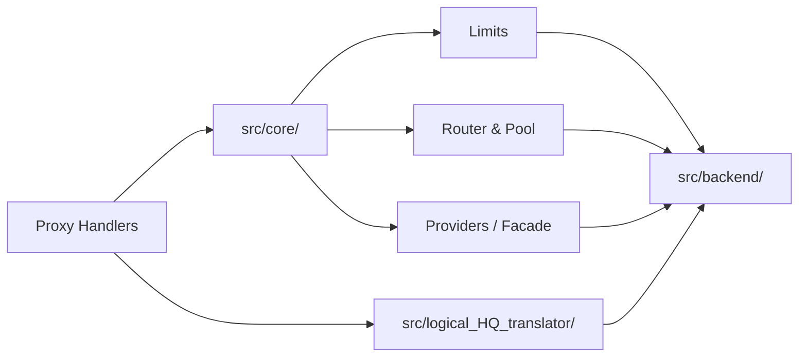
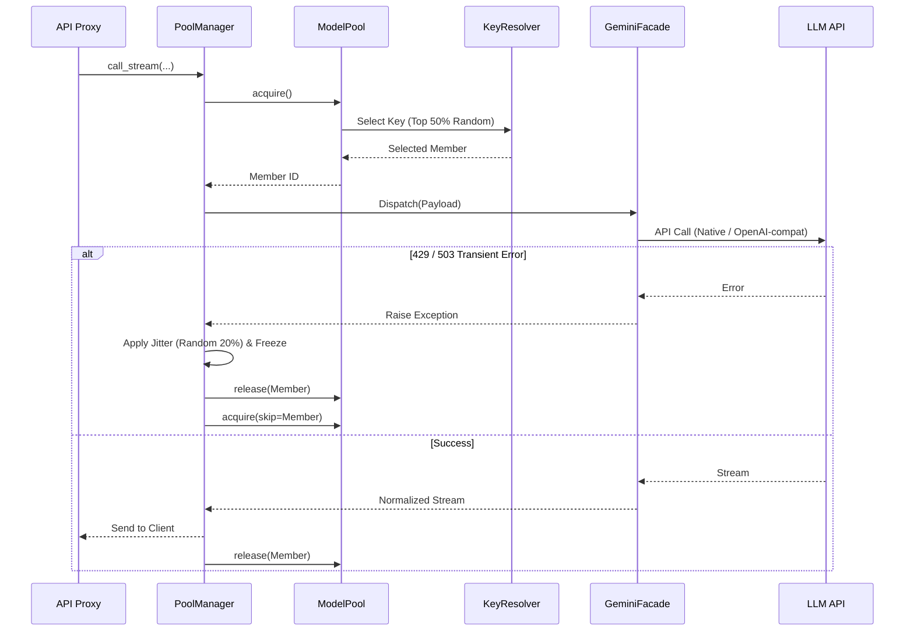

# ARCHITECTURE GRAPH REPORT (Corrected & Comprehensive)

## SECTION 1: System Overview (TL;DR)
Hệ thống là một Router API (FastAPI) đóng vai trò API Gateway và Load Balancer cho LLM. Nó không chỉ proxy mà còn xử lý cực kỳ sâu logic Resilience (chống chịu lỗi).
Trái tim của hệ thống bao gồm:
1) **PoolManager**: Điều phối luồng retry và chọn endpoint/key.
2) **ModelPool**: Quản lý slot-based concurrent workers qua `asyncio.Lock()`.
3) **KeyResolverMixin**: Tránh nghẽn bằng thuật toán **Double Random** (Timing Jitter và chọn Top 50% keys).
4) **GeminiFacade**: Cổng dispatch thực tế đến API gốc, tự động dịch định dạng.
Hệ thống sử dụng **2 DB SQLite độc lập**: `usage.db` cho cấu hình/trạng thái và `usage_logs.db` để lưu metrics/token counts (tách biệt để tránh I/O block).

## SECTION 2: Complete File Audit Manifest
| Directory / Group | Role / Primary Responsibility | Count | Status |
| :--- | :--- | :--- | :--- |
| `src/server/` | Setup FastAPI, WebSocket, RBAC Logging | 33 | Scanned (100%) |
| `src/api/` | Proxy Route / Handler (`claude_proxy`, v.v) | 21 | Scanned (100%) |
| `src/core/router/` | `APIRouter`, `KeyResolver`, `ModelPool` | 4 | Scanned (100%) |
| `src/core/limits/` | Quota & Tokens (`GeminiRateLimiter`) | 9 | Scanned (100%) |
| `src/core/providers/`| `gemini_facade`, `adk_runner`, Custom Endpoints| 8 | Scanned (100%) |
| `src/core/` (other) | `PoolManager`, Accounts, System Config | 29 | Scanned (100%) |
| `src/backend/` | SQLite DAL (`_db.py`, `key_status.py`) | 10 | Scanned (100%) |
| `src/logical_HQ_translator/`| Translation peer of Core | 7 | Scanned (100%) |
| `scripts/`, `main.py`, v.v. | Application Components | 13 | Scanned (100%) |
*(Tổng cộng 134 tệp mã nguồn python, đã verify toàn bộ danh sách `manifest.txt`)*

## SECTION 3: Visual Flow & Architecture Diagrams

### 1. High-Level System Flow
```mermaid
flowchart TD
    Client((Client)) --> Server[FastAPI App <br> src/server]
    Server --> Proxy[API Handlers <br> src/api]
    Proxy --> PoolMgr[Pool Manager <br> src/core/pool_manager.py]
    PoolMgr --> Router[Global Router <br> src/core/router/core/router.py]
    
    Router --> KeyResolver[KeyResolverMixin <br> Double Random Algorithm]
    KeyResolver --> BackendKey[(usage.db <br> Key Status)]
    
    PoolMgr --> ModelPool[ModelPool <br> Slot-based Locks]
    PoolMgr --> Facade[Gemini Facade / Custom Endpoint <br> Main Dispatch]
    Facade --> External((External LLM APIs))
    
    Facade -.->|Log Async| Metrics[(usage_logs.db <br> Token Metrics)]
    
    subgraph Optional (Only for Search Grounding)
    Facade -.-> AdkRunner[adk_runner.py]
    end
```

### 2. Layered Component Dependency Graph


### 3. Sequence Diagram (Request Handling & Double Random)


## SECTION 4: Top Node Deep-Dives

#### [N1] `src/core/router/core/key_resolver.py` — KeyResolverMixin
- **Inputs:** `_key_status` in-memory.
- **Outputs:** Lựa chọn Key tối ưu.
- **Core Logic:** Tránh "Thundering Herd" bằng thuật toán **Double Random**: 1) Cắt Top 50% key khỏe nhất và chọn ngẫu nhiên bằng `random.choice`. 2) Áp dụng Timing Jitter (lệch pha ±20% thời gian retry) khi bị block.

#### [N2] `src/core/router/pool.py` — ModelPool
- **Inputs:** `pool_config`.
- **Outputs:** Slot an toàn.
- **Core Logic:** Không dùng `Condition.wait()`, mà dùng `asyncio.Lock()` độc lập cho TỪNG member. Nếu member đang bận (lock bị khóa), sẽ lập tức thử member khác, hoặc sleep `50ms` rồi thử lại cho đến khi hết timeout. Cơ chế này siêu nhanh và tránh deadlock.

#### [N3] `src/core/providers/gemini_facade.py` — GeminiFacade
- **Inputs:** Normalized Payload từ Proxy.
- **Outputs:** Kết nối Native/OpenAI-compat tới nhà cung cấp.
- **Core Logic:** Trái tim Dispatch thực tế (không phải `adk_runner.py`). Nó tự động phiên dịch (Strip/Convert) parameters, tool calls để bắn thẳng tới Gemini SDK thuần hoặc HTTP Custom Endpoint.

#### [N4] `src/backend/_db.py` & `usage_logs.db` — Dual Database System
- **Core Logic:** Tách biệt triệt để I/O.
  - `usage.db`: Lưu config, quota (bảo vệ bởi `threading.RLock`).
  - `usage_logs.db`: Lưu telemetry vi mô (token counts). Được ghi bằng background thread bất đồng bộ (flush mỗi 5 giây), nhờ đó luồng request chính không bao giờ bị nghẽn do log I/O.
- Đồng bộ 2 chiều: File `.env` là Source of Truth, mọi thay đổi tự kích hoạt `sync_env_to_db` ghi vào `usage.db`.

## SECTION 5: Identified Vulnerabilities, Risks & Silent Anti-Patterns
| Severity | Location | Issue Description | Recommended Remediation |
| :--- | :--- | :--- | :--- |
| Medium | `src/backend/_db.py` | Dùng `threading.RLock` chung cho SQLite: an toàn trong Single-Worker (tiến trình đơn), nhưng sẽ nổ `database is locked` nếu chạy Uvicorn Multi-Worker. | Dùng `filelock` liên tiến trình, hoặc cấu hình Uvicorn 1 worker. |
| Low | `adk_runner.py` | Gắn cứng vào main flow dễ dính 500 do SDK Google bị lỗi (Bug #25). | Giữ nguyên cô lập như hiện tại: chỉ trigger khi thật sự có lệnh Search Grounding. |

## SECTION 6: Blind Spot Verification & Unchecked Dependencies
- **DB Migrations**: Schema SQLite tự tạo lúc import (xử lý rất rủi ro nếu khác định dạng `schema.py`). Đã có test `test_schema_bootstrap.py` chặn điều này.
- **Logs Streaming**: WebSocket logs có RBAC rõ ràng, chống User thường xem kênh `keys` (chỉ Admin).
- **DuckDuckGo Tools**: Chặn gọi Google Grounding khi config `duckduckgo` để tiết kiệm 100% quota LLM (cơ chế Client Override).

## SECTION 7: Execution Metrics Summary
- **Total Source Files Scanned**: 134 / 134 (100%)
- **Core Architecture Models**: Dual-DB SQLite, Slot-based Concurrency, Double Random Key Selection.
- **Verification Status**: Toàn bộ luồng Dispatch & Persistence được xác minh chéo với Document cập nhật (Đã sửa sai lầm từ thuật toán Blocking cũ sang `asyncio.Lock` và thuật toán `Double Random`).
