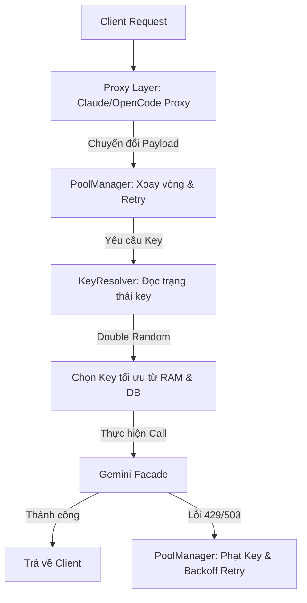

# Kiến Trúc Định Tuyến & Cơ Chế Chống Lỗi (Rate Limit & Resilience Guide)

Tài liệu này giải thích chi tiết các giải pháp kỹ thuật được triển khai trong Router API v2 để đối phó với hiện tượng nghẽn mạng, lỗi Rate Limit (429), lỗi dịch vụ không khả dụng (503), và cơ chế phân phối tải đa luồng có độ tin cậy cao.

---

## 1. Tổng Quan Luồng Request qua Hệ Thống

Khi một Client (như Claude Code hoặc OpenCode) gửi yêu cầu đến Gateway, luồng xử lý đi qua các tầng sau:



1. **Proxy Layer (Tầng chuyển đổi):** [ClaudeProxy](file:///d:/AI_Projects/router_api/src/api/claude_proxy/handler/proxy.py) và [OpenCodeProxy](file:///d:/AI_Projects/router_api/src/api/opencode_proxy/handler/proxy.py) chỉ đóng vai trò chuyển đổi định dạng request/response từ client thành định dạng dùng chung của hệ thống. Tầng này không chứa logic chọn key hay retry.
2. **PoolManager (Tầng điều phối vòng lặp):** [PoolManager](file:///d:/AI_Projects/router_api/src/core/pool_manager.py) quản lý vòng lặp xoay vòng (rotation) qua các pool member và thực hiện retry khi gặp lỗi tạm thời.
3. **KeyResolver & Router (Tầng quyết định):** [KeyResolver](file:///d:/AI_Projects/router_api/src/core/router/core/key_resolver.py) thực hiện việc tính toán độ ưu tiên (Priority Score), kiểm tra giới hạn RPM/TPM thực tế của từng key, và chọn key.

---

## 2. Cơ Chế Xử Lý Lỗi 429 và 503 (Soft Handling vs Hard Freeze)

Để duy trì hiệu suất cao, hệ thống phân loại lỗi thành hai nhóm chính: **Lỗi tạm thời (Transient Errors)** và **Lỗi vĩnh viễn (Permanent Errors)**.

### Phân Loại Chi Tiết

Hệ thống sử dụng một cách tiếp cận hai tầng để phân loại lỗi: đầu tiên là phân loại lỗi cụ thể của nhà cung cấp (hiện tại là Gemini), sau đó là so khớp dựa trên văn bản cho các lỗi chung.

#### **Tầng 1: Phân loại lỗi Gemini cụ thể (`classify` trong `src/core/providers/gemini/error.py`)**
Đây là tầng phân loại chính xác nhất cho các lỗi cụ thể của Gemini. Nó trích xuất `code` (mã HTTP), `status` (chuỗi trạng thái GRPC/Google Cloud), và `message` từ các ngoại lệ và phân loại theo thứ bậc:

1.  **Mã trạng thái HTTP:** Ưu tiên phân loại dựa trên các mã HTTP (400, 401, 403, 404, 429, 500, 503, 504).
2.  **Chuỗi trạng thái:** Nếu không có mã HTTP rõ ràng, kiểm tra các chuỗi trạng thái như "RESOURCE_EXHAUSTED", "PERMISSION_DENIED", "INVALID_ARGUMENT", "UNAVAILABLE".
3.  **So khớp chuỗi fallback:** Đối với các lỗi ít cấu trúc hơn, sử dụng regex/so khớp từ khóa trong `message`.

#### **Tầng 2: Phân loại lỗi chung (`_classify_error` trong `src/core/pool_manager.py`)**
Đây là tầng phân loại thứ hai, hoạt động như một lưới an toàn. Nó gọi `classify(e)` từ tầng 1 trước. Nếu tầng 1 trả về "unknown", nó sẽ tiếp tục thực hiện so khớp dựa trên văn bản với các từ khóa rộng hơn để bắt các lỗi không được phân loại cụ thể bởi tầng Gemini.

**Bảng Ánh Xạ Phân Loại Lỗi:**

| Loại Lỗi (Text/Code Signature) | Lý Do Phân Loại | Mô Tả | Xử Lý |
| :------------------------------ | :-------------- | :---- | :---- |
| Mã HTTP 400, "invalid_argument", "bad_request" | `bad_request` | Yêu cầu không đúng định dạng hoặc tham số không hợp lệ. | Hard Freeze |
| Mã HTTP 401, "api key invalid", "unauthorized" | `invalid_key` | API Key không hợp lệ hoặc thiếu. | Hard Freeze |
| Mã HTTP 403, "permission denied" | `permission_denied` | Không có quyền truy cập chung. | Hard Freeze |
| Mã HTTP 403, "denied access" | `project_denied` | Không có quyền truy cập vào dự án cụ thể. | Hard Freeze |
| Mã HTTP 404, "not found" | `unavailable` | Tài nguyên không tìm thấy hoặc model không khả dụng. | Soft Handling |
| Mã HTTP 429, "rate limit", "resource exhausted" | `rate_limit` | Vượt quá giới hạn yêu cầu hoặc token mỗi phút (RPM/TPM). | Soft Handling |
| Mã HTTP 429, "quota exceeded", "daily" | `project_quota_429` | Vượt quá giới hạn yêu cầu mỗi ngày (RPD). | Soft Handling |
| Mã HTTP 500, 503, 504, "unavailable", "overloaded", "timeout" | `unavailable` | Dịch vụ không khả dụng, lỗi máy chủ, hoặc timeout. | Soft Handling |
| "grounding", "google_search", "tool is not allowed" | `grounding_fallback` | Lỗi liên quan đến công cụ tìm kiếm hoặc grounding. | Soft Handling |
| Mọi lỗi khác                    | `unknown`       | Lỗi không xác định. | Soft Handling (mặc định) |

### Sự khác biệt trong cách xử lý:

### Sự khác biệt trong cách xử lý:

| Đặc tính | Lỗi Tạm Thời (429, 503, Timeout) | Lỗi Vĩnh Viễn (invalid_key, billing_error) |
| :--- | :--- | :--- |
| **Trạng thái key** | **Soft Handling**: Cooldown cực ngắn (`KEY_429_COOLDOWN_SECONDS` ≈ 8-15 giây). | **Hard Freeze**: Đóng băng dài hạn (`KEY_INVALID_COOLDOWN_SECONDS` = 3600 giây). |
| **Xếp hạng Priority** | Áp dụng hình phạt giảm điểm tạm thời (`apply_error_penalty` trừ điểm score) để tránh chọn lại ngay. | Đóng băng vĩnh viễn trên RAM & DB, không cho phép chọn. |
| **Xử lý Pool** | Không tăng chỉ số lỗi vĩnh viễn của thành viên pool (`pool.record_failure`), chỉ tích lũy bộ đếm tạm thời để chuẩn bị swap model khi vượt quá giới hạn. | Gọi `pool.record_failure` ngay lập tức để swap sang model thành viên khác hoặc custom endpoint khác. |
| **Độ trễ Retry** | Áp dụng thuật toán **Timing Jitter** rồi thử lại. | Chuyển đổi key hoặc model ngay lập tức. |

---

## 3. Thuật Toán Double Random (Tránh Thundering Herd & Key Collision)

Khi hệ thống xử lý đồng thời hàng chục request (high concurrency), nếu tất cả các luồng đều chọn key "tốt nhất" (Greedy Selection) hoặc thử lại cùng một lúc (Synchronized Retry), hệ thống sẽ ngay lập tức kích hoạt lỗi 429 hàng loạt trên key đó (Rate Limit Cascade). 

Để giải quyết triệt để vấn đề này, Router API v2 triển khai thuật toán **Double Random** gồm 2 lớp bảo vệ ngẫu nhiên độc lập:

### Lớp 1: Ngẫu nhiên hóa thời gian chờ (Timing Jitter)
Trong hàm `_retry_delay`, thay vì chờ một khoảng thời gian cố định dạng lũy thừa ($1s, 2s, 4s...$), hệ thống tính toán một độ lệch ngẫu nhiên (Jitter) khoảng $\pm 20\%$ dựa trên khoảng cách cơ sở:

```python
def _retry_delay(attempt: int) -> float:
    import random
    if attempt >= config.POOL_SWAP_FAILURES * 2:
        return random.uniform(0.3, 0.7)
    base = min(config.GEMINI_API_KEY_INTERVAL * (2 ** attempt), config.KEY_429_COOLDOWN_SECONDS * 2)
    jitter = random.uniform(-base * 0.2, base * 0.2)
    return max(config.GEMINI_API_KEY_INTERVAL, base + jitter)
```
*Tác dụng:* Phân tán thời điểm gửi lại request của các luồng đang chờ, tránh hiện tượng "Thundering Herd" (nhiều client cùng ùa vào gửi yêu cầu tại cùng một mili-giây).

### Lớp 2: Ngẫu nhiên hóa lựa chọn Key (Priority Selection Randomization)
Trong hàm `reserve_key`, thay vì luôn chọn key có điểm Priority Score cao nhất hoặc ít tải nhất, hệ thống thực hiện:
1. Lọc và sắp xếp toàn bộ danh sách key khả dụng theo thứ tự ưu tiên: ít `active_requests` nhất trước, sau đó là điểm Priority cao nhất, cuối cùng là ít lỗi liên tục nhất.
2. Cắt lấy **Top 50%** key tốt nhất trong danh sách ứng viên khỏe mạnh.
3. Chọn ngẫu nhiên một key từ nhóm 50% này (`random.choice`).

```python
# Lọc lấy top 50% key khỏe nhất để phân tán tải
top_50_percent = int(len(candidates_with_priority) * 0.5)
chosen_cand = random.choice(candidates_with_priority[:max(1, top_50_percent)])
selected_key = chosen_cand[1]
```
*Tác dụng:* Dưới áp lực tải cao, các request sẽ được phân phối đều trên nhiều key thuộc nhóm "tốt", giảm thiểu tối đa xác suất hai luồng xử lý song song chọn trúng cùng một API Key và gây ra xung đột hạn ngạch (quota collision).

---

## 4. Chế Độ Phòng Chống Nghẽn Tải Cực Cao (Extreme Checking Logic)

Khi một request bị lỗi liên tục và số lần thử lại đạt tới giới hạn nghiêm trọng (`attempt >= 10`), hệ thống sẽ kích hoạt bộ lọc bảo vệ cực đoan (**Extreme Checking**):

1. **Siết chặt hạn ngạch (Throttling down to 70%):** RPM và TPM tối đa cho phép của key bị ép giảm xuống còn 70% công suất thiết kế.
2. **Không chấp nhận chia sẻ tải:** Chỉ những key hoàn toàn rảnh rỗi (`active_requests == 0`) và không trong thời gian cooldown mới được phép sử dụng.
3. **Ưu tiên yêu cầu nhỏ:** Đối với các prompt lớn vượt giới hạn 70% TPM, yêu cầu sẽ bị chặn ngay lập tức nếu key có bất kỳ hoạt động nào trong vòng 60 giây qua, bảo vệ key khỏi bị quá tải hoàn toàn.

Cơ chế này hoạt động như một van an toàn (Safety Valve) giúp hạ nhiệt hệ thống khi đang xảy ra tình trạng bão request 429 trên diện rộng.


---

## 5. Cơ Chế Giới Hạn Tải Trượt (Sliding Window Deque) trong Concurrency

Trong `GeminiRateLimiter` (`src/core/limits/gemini_rate_limiter.py`), các hàng đợi hai đầu (deque) được sử dụng để theo dõi số lượng yêu cầu (RPM) và token (TPM) trong cửa sổ trượt 60 giây. Để đảm bảo an toàn luồng và tính nguyên tử (atomicity) của các thao tác kiểm tra và cập nhật giới hạn, phương thức `acquire_quota` sử dụng một `asyncio.Lock()`.

**Tác dụng:** `asyncio.Lock` bảo vệ toàn bộ khối mã kiểm tra giới hạn (chiều dài deque, tổng token) và cập nhật (thêm yêu cầu/token mới vào deque). Điều này ngăn chặn tình trạng race condition, đảm bảo rằng các thao tác này diễn ra một cách tuần tự và nhất quán, ngay cả khi có nhiều yêu cầu đồng thời trong cùng một tiến trình.

---

## 6. Cơ chế Lan Truyền Lỗi HTTP Chuẩn (Proper HTTP Error Propagation)

### Vấn đề trước refactor:
Trước đó, khi gặp lỗi Rate Limit (429) hoặc Overloaded (503), Claude Proxy luôn bắt ngoại lệ (exception) ở tầng handler bên trong và trả lời client bằng một chuỗi SSE text thông báo lỗi ở mã trạng thái **HTTP 200 OK**:
`⚠️ [Hệ thống quá tải tạm thời / System Overloaded] ⚠️ ...`

Đối với các ứng dụng chat thông thường, điều này giúp hiển thị giao diện thân thiện cho người dùng. Tuy nhiên, đối với **Agent tự trị (như Claude Code)**, đây là một **anti-pattern nghiêm trọng** vì:
- Agent coi thông báo lỗi này là *phản hồi văn bản hợp lệ* từ mô hình và cố gắng "trò chuyện" tiếp, dẫn đến việc nhồi nhét nội dung lỗi vào lịch sử chat (Context Bloat).
- Agent lặp lại yêu cầu liên tục trong một vòng lặp vô hạn (Infinite Loop), khiến dung lượng context tăng vọt nhưng chỉ số token metadata của API response giả lập lại rất nhỏ (làm thanh hiển thị context của người dùng báo sai chỉ số, ví dụ `0.1k/200k`).

### Giải pháp khắc phục:
- **Tách biệt luồng xử lý:** 
  - Với **Main Agent** (luồng chat chính): Loại bỏ try-except giả lập ở Proxy. Khi có lỗi rate limit / timeout, hệ thống sẽ lan truyền (propagate) lỗi lên FastAPI để trả về mã lỗi HTTP thật (`429 Rate Limit` hoặc `503 Overloaded`). Client (Claude Code CLI) khi thấy mã lỗi HTTP này sẽ tự động backoff retry ở tầng client một cách tự nhiên mà không làm bẩn context.
  - Với **Sub-Agent** (luồng chạy lệnh ngầm song song): Tiếp tục giữ cơ chế bắt lỗi và trả về text thông báo mô phỏng mã 200 OK ở hàm `handle_sub_agent_error` để tránh việc CLI của client bị crash đột ngột khi các sub-agent thăm dò tệp bị lỗi tạm thời.

---

## 7. Cơ Chế Tính Điểm Key (Priority Scoring)

Logic tính điểm key ưu tiên nằm trong hàm `get_key_priority` (từ `src/core/limits/gemini_rate_limiter.py`), được sử dụng bởi `KeyResolverMixin` để chọn key hiệu quả nhất.

#### **Các yếu tố được xem xét khi tính điểm:**

*   **`active_requests` (Số yêu cầu đang hoạt động):** Đây là yếu tố quan trọng nhất để cân bằng tải theo thời gian thực. Key có ít yêu cầu đang hoạt động hơn sẽ có ưu tiên cao hơn.
*   **`frozen_until` (Thời gian đóng băng):** Các key đang bị đóng băng (chưa hết thời gian `frozen_until`) sẽ có điểm ưu tiên rất thấp hoặc bị loại bỏ hoàn toàn khỏi danh sách ứng viên.
*   **`consecutive_failures` (Số lỗi liên tiếp):** Key có số lỗi liên tiếp gần đây sẽ bị phạt điểm. Số lỗi càng nhiều, hình phạt càng nặng.
*   **`last_success` (Lần thành công gần nhất):** Key có yêu cầu thành công gần đây hơn sẽ được ưu tiên, phản ánh tính ổn định hiện tại của key.
*   **`_score_penalties` (Hình phạt điểm):** Các hình phạt động được áp dụng cho key vì các lý do lỗi khác nhau (ví dụ: `rate_limit`, `unavailable`) sẽ làm giảm điểm của key đó. Các hình phạt này có thời gian hết hạn và được quản lý trong bộ nhớ và đồng bộ với DB.
*   **`model_priority` (Ưu tiên model):** Một điểm ưu tiên cơ bản có thể cấu hình cho các bí danh model khác nhau (được định nghĩa trong `MODEL_PRIORITY` từ `src/core/api_config.py`).
*   **Tier (Hạng của tài khoản):** Hạng của tài khoản người dùng (free, premium, admin) ảnh hưởng đến việc những key nào được xem xét. Key của hạng cao hơn có thể được ưu tiên truy cập vào các pool key chất lượng hơn.

#### **Logic tổng thể:**

Hàm `get_key_priority` kết hợp tất cả các yếu tố này để tạo ra một điểm số số học toàn diện. Điểm số càng cao, key càng được ưu tiên. Điểm này sau đó được sử dụng trong thuật toán `_select_key_double_random` (`src/core/router/core/key_resolver.py`) để sắp xếp và chọn key, đảm bảo rằng các yêu cầu được phân phối một cách hiệu quả và linh hoạt nhất, tối ưu hóa hiệu suất và khả năng chống chịu lỗi của hệ thống.

---

## 8. Các Biến Môi Trường Chính